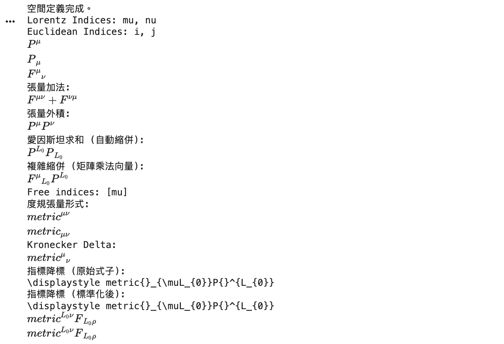

# 第三章：抽象張量演算 (Abstract Tensor Calculus)

本章我們進入 `sympy.tensor.tensor` 模組。這裡的運算不依賴具體的座標系（如球座標或直角座標），而是處理張量之間的代數關係（如 $A^\mu B_\mu$）。這是廣義相對論推導的核心工具。

### 0. 引入必要模組

在開始之前，請確保引入了正確的類別。

```python
from sympy import symbols, init_printing, diag
from sympy.tensor.tensor import TensorIndexType, TensorIndex, TensorHead, tensor_indices

# 啟用 LaTeX 數學顯示
init_printing(use_latex='mathjax')
```

---

## 3.1 定義張量空間與指標類型 (`TensorIndexType`)

在物理學中，張量必須依附於某個空間（流形）。SymPy 使用 `TensorIndexType` 來定義這個空間及其度規性質。

### 程式碼範例

```python
# 1. 定義一個洛倫茲空間 (Lorentzian Manifold)
# structure=TensorIndexType.Lorentz 表示這是一個相對論時空 (擁有 Minkowski 度規)
# dummy_name='L' 用於自動生成求和時的虛設指標名稱
L = TensorIndexType('L', dummy_name='L')

# 2. 定義歐幾里得空間 (Euclidean Space)
# metric_symmetry=1 表示度規是對稱的 (g_ij = g_ji)
# dim=3 指定維度為 3
E = TensorIndexType('E', dummy_name='E', dim=3, metric_symmetry=1)

# 3. 定義指標符號 (Indices)
# mu, nu, rho 屬於洛倫茲空間 L
mu, nu, rho, sigma = tensor_indices('mu nu rho sigma', L)

# i, j, k 屬於歐幾里得空間 E
i, j, k = tensor_indices('i j k', E)

print("空間定義完成。")
print(f"Lorentz Indices: {mu}, {nu}")
print(f"Euclidean Indices: {i}, {j}")
```




> **概念解析**：
> *   **`TensorIndexType`**：定義了指標的規則。例如，洛倫茲空間允許指標升降（因為有度規），而沒有度規的空間則不允許。
> *   **`dummy_name`**：當 SymPy 進行愛因斯坦求和時，它需要創造一些臨時的指標名字（如 $L_0, L_1$），這裡指定了它們的前綴。

---

## 3.2 定義張量實體 (`TensorHead`)

定義好了空間和指標後，我們需要定義「張量」本身。`TensorHead` 用來創建像 $A^\mu$ 或 $T_{\mu\nu}$ 這樣的物理量。

### 程式碼範例

```python
# 定義張量頭 (Tensor Heads)
# 括號內的 [L] 表示這個張量的第一個指標屬於 L 空間
# 如果是二階張量，可以寫 [L, L]

# 1. 定義一個 4-向量 P (例如動量)
P = TensorHead('P', [L])

# 2. 定義一個二階張量 F (例如電磁張量)
F = TensorHead('F', [L, L])

# 3. 定義一個純量 phi (沒有指標)
phi = TensorHead('phi', [])

# 建立張量表達式
# 在 SymPy 中：
# mu  (正) 代表 上指標 (Contravariant, ^mu)
# -mu (負) 代表 下指標 (Covariant, _mu)

expr_vec_up = P(mu)   # P^mu
expr_vec_down = P(-mu)  # P_mu
expr_tensor = F(mu, -nu) # F^mu_nu

display(expr_vec_up)
display(expr_vec_down)
display(expr_tensor)
```

> **關鍵語法**：
> *   **上指標 (Contravariant)**：直接傳入 `mu`。
> *   **下指標 (Covariant)**：傳入 `-mu` (負號)。
> *   這是 SymPy 張量模組最重要的約定，請務必記住。

---

## 3.3 張量代數運算

這一節展示張量的加法、乘法以及最重要的**愛因斯坦求和約定 (Einstein Summation Convention)**。當一個指標在同一項中出現兩次（一次上，一次下）時，即代表對該指標求和。

### 程式碼範例

```python
# 1. 張量加法
# 只有指標結構相同的張量才能相加
term1 = F(mu, nu)
term2 = F(nu, mu) # 注意指標順序不同
add_expr = term1 + term2

print("張量加法:")
display(add_expr)

# 2. 張量乘法 (外積)
# P^mu * P^nu -> T^{mu nu}
mult_expr = P(mu) * P(nu)

print("張量外積:")
display(mult_expr)

# 3. 愛因斯坦求和 (縮併 Contraction)
# P^mu * P_mu -> Scalar (P^2)
# 注意：這裡我們用 -mu 來表示下指標
contraction = P(mu) * P(-mu)

print("愛因斯坦求和 (自動縮併):")
display(contraction)

# 4. 檢查自由指標與虛設指標
# 自由指標：未被求和的指標
# 虛設指標：被求和掉的指標
complex_expr = F(mu, -nu) * P(nu) # F^mu_nu * P^nu -> 結果應該剩下 mu (上標)

print("複雜縮併 (矩陣乘法向量):")
display(complex_expr)

# 查看指標資訊
print(f"Free indices: {complex_expr.get_free_indices()}")
# 注意：虛設指標在內部會被重新命名，以避免衝突
```

---

## 3.4 度規張量 (The Metric Tensor)

度規張量 $g_{\mu\nu}$ 是連結上指標與下指標的橋樑。在 SymPy 中，`TensorIndexType` 會自動附帶一個度規張量。

### 程式碼範例

```python
# 取得度規張量
g = L.metric

print("度規張量形式:")
display(g(mu, nu))      # g^{mu nu}
display(g(-mu, -nu))    # g_{mu nu}

# 1. Kronecker Delta
# 混合指標的度規就是 Kronecker Delta
delta = g(mu, -nu)
print("Kronecker Delta:")
display(delta)

# 2. 指標升降 (Raising and Lowering)
# 我們手動將 P^mu 降標： g_{mu nu} P^nu
lowering_expr = g(-mu, -nu) * P(nu)

print("指標降標 (原始式子):")
display(lowering_expr)

# 使用 canonicalize() 來簡化結果
# SymPy 應該會自動將其識別為 P_mu
print("指標降標 (標準化後):")
from sympy.tensor.tensor import canonicalize
simplified = canonicalize(lowering_expr)
display(simplified)

# 3. 複雜的度規收縮
# g^{mu nu} F_{mu rho} -> F^nu_rho
complex_metric = g(mu, nu) * F(-mu, -rho)
display(complex_metric)
display(canonicalize(complex_metric))
```

> **重點技巧**：
> *   **`canonicalize()`**：這是張量運算中最重要的函數。當你寫出一長串包含度規、排列符號或多項乘積的式子時，它們通常不會自動化簡。呼叫 `canonicalize()` 會強制 SymPy 執行所有可能的指標收縮（Contraction）和對稱性整理，將 $g_{\mu\nu} A^\nu$ 變成 $A_\mu$。

---

### 第三章練習題

1.  定義一個反對稱張量 $F_{\mu\nu}$ (即 $F_{\mu\nu} = -F_{\nu\mu}$)。
2.  計算標量 $S = F^{\mu\nu} F_{\mu\nu}$。
3.  嘗試計算 $P^\mu F_{\mu\nu}$，並觀察標準化後的結果指標位置。

*(提示：反對稱性設定將在第四章詳細介紹，但現在您可以試著忽略對稱性設定，直接操作指標運算)*

---

**下一章預告：**
現在我們學會了基本的 $A^\mu B_\mu$ 運算。但如果張量有特殊的性質怎麼辦？例如電磁張量 $F_{\mu\nu}$ 是反對稱的，或者黎曼張量有複雜的對稱性。第四章我們將介紹 **「張量對稱性與標準化」**，讓 SymPy 自動幫你把 $A_{ij} + A_{ji}$ 化簡為 $0$（如果是反對稱的話）。

