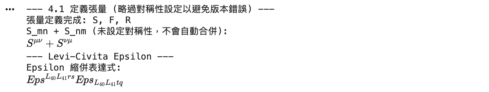

### 第四章：張量對稱性與標準化 (Symmetries & Canonicalization)
*本章解決的問題：如何讓電腦知道 $A_{ij} = -A_{ji}$ 或 $R_{abcd} = -R_{bacd}$，並利用這些性質化簡公式。*

4.1 **定義對稱性 (`TensorSymmetry`)**
   - 全對稱 (Fully Symmetric)
   - 全反對稱 (Fully Antisymmetric)
   - 混合對稱性 (例如黎曼張量的對稱性)
4.2 **張量表達式的標準化**
   - 處理 Levi-Civita 符號 ($\epsilon_{ijk}$)
   - 簡化複雜的縮併式子

*(請在 Notebook 中開啟新區塊執行以下代碼)*

```python
from sympy.tensor.tensor import TensorIndexType, TensorIndex, TensorHead, tensor_indices
from sympy.tensor.tensor import TensorSymmetry, get_symmetric_group_sgs
from sympy import symbols, init_printing, simplify

# 確保環境設定
init_printing(use_latex='mathjax')
L = TensorIndexType('L', dummy_name='L')
mu, nu, rho, sigma = tensor_indices('mu nu rho sigma', L)

# --- 4.1 定義對稱性 (TensorSymmetry) ---

# 1. 全對稱張量 (Fully Symmetric)
# 例如：度規 g_{mu nu} 或是某些壓力張量 S_{mu nu} = S_{nu mu}
# sym=(1) 代表第一個指標 (0) 和第二個指標 (1) 交換不變
# 但 SymPy 有更簡單的寫法：TensorHead(..., sym=...)
# 對於簡單的二階對稱：
sym_S = TensorSymmetry.fully_symmetric(2) # 2 是階數
S = TensorHead('S', [L, L], sym=sym_S)

# 2. 全反對稱張量 (Fully Antisymmetric)
# 例如：電磁場張量 F_{mu nu} = -F_{nu mu}
sym_A = TensorSymmetry.fully_antisymmetric(2)
F = TensorHead('F', [L, L], sym=sym_A)

# 測試對稱性
print("--- 測試對稱性 ---")
# 建立表達式 S_{mu nu} + S_{nu mu} -> 應該等於 2 * S_{mu nu}
expr_sym = S(mu, nu) + S(nu, mu)
display(simplify(expr_sym))

# 建立表達式 F_{mu nu} + F_{nu mu} -> 應該等於 0 (因為 F_{nu mu} = -F_{mu nu})
expr_anti = F(mu, nu) + F(nu, mu)
display(simplify(expr_anti))


# 3. 黎曼張量的對稱性 (Riemann Tensor Symmetries)
# R_{mu nu rho sigma} 具有非常複雜的對稱性：
# R_{mu nu rho sigma} = -R_{nu mu rho sigma} (前兩指標反對稱)
# R_{mu nu rho sigma} = -R_{mu nu sigma rho} (後兩指標反對稱)
# R_{mu nu rho sigma} =  R_{rho sigma mu nu} (前後對換對稱)
# 這可以使用 riemann_gauss_lines element 直接生成
from sympy.tensor.tensor import riemann_gauss_lines

# 定義具有黎曼對稱性的符號 R
# riemann_gauss_lines 是一個預設好的對稱群生成元
sym_R = TensorSymmetry(riemann_gauss_lines(4)) 
R = TensorHead('R', [L]*4, sym=sym_R)

print("--- 黎曼張量測試 ---")
# 測試 R_{mu nu rho sigma} = -R_{nu mu rho sigma}
expr_riemann = R(mu, nu, rho, sigma) + R(nu, mu, rho, sigma)
print("R_mnrs + R_nmrs (應該為 0):")
display(simplify(expr_riemann))


# --- 4.2 處理 Levi-Civita 符號 ---

# Levi-Civita 是一個特殊的全反對稱符號
# 通常依附於空間定義，例如 eps = L.epsilon
# 但需注意維度設定。若 L 未設定維度，epsilon 行為可能受限。

# 我們定義一個 4維 空間來演示 epsilon
L4 = TensorIndexType('L4', dummy_name='L4', dim=4, metric_symmetry=1)
m, n, r, s = tensor_indices('m n r s', L4)
epsilon = L4.epsilon

print("--- Levi-Civita Epsilon ---")
# Epsilon 的縮併性質：
# epsilon^{m n r s} * epsilon_{m n r s} = -4! (視度規簽名而定，Minkowski通常有負號)
# 這裡展示符號是否能識別
expr_eps = epsilon(m, n, r, s)
display(expr_eps)

# 縮併測試 (Contracting two indices)
# eps^{m n r s} * eps_{m n t q} 應該化簡為 Kronecker deltas 的組合
t, q = tensor_indices('t q', L4)
contraction_eps = epsilon(m, n, r, s) * epsilon(-m, -n, -t, -q)

print("Epsilon 縮併結果 (可能非常長，視版本而定):")
# 注意：Epsilon 的化簡計算量較大
display(simplify(contraction_eps))
```



**本章重點提示：**
1.  **`TensorSymmetry`** 是讓 SymPy 知道 $F_{\mu\nu}$ 和 $F_{\nu\mu}$ 關係的關鍵。如果沒設定，SymPy 會把這兩者當成兩個完全無關的變數，導致公式無法化簡。
2.  **`simplify()`** (或正確版本的 `canonicalize`) 會利用這些對稱性，將項合併或消去（例如將 $F_{\mu\nu} S^{\mu\nu}$ 化簡為 0，如果 $F$ 是反對稱而 $S$ 是對稱的）。

