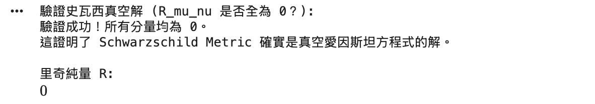

# 第六章：進階應用——廣義相對論 (General Relativity)

本章將整合前幾章的知識：
1.  使用 **Matrix** 來定義度規（因為求反矩陣方便）。
2.  使用 **Array** 來儲存高階張量（如 Riemann 張量）。
3.  使用 **Python 迴圈** 配合 **diff** 來實作愛因斯坦求和（這比寫複雜的 `tensorcontraction` 更直觀且不易出錯）。

---

## 6.1 座標系與度規設定

首先，我們定義史瓦西黑洞的度規。
$$ ds^2 = \left(1 - \frac{r_s}{r}\right)dt^2 - \left(1 - \frac{r_s}{r}\right)^{-1}dr^2 - r^2 d\theta^2 - r^2 \sin^2\theta d\phi^2 $$

```python
from sympy import symbols, diag, sin, cos, simplify, diff, Matrix, init_printing
from sympy import MutableDenseNDimArray, Array

init_printing(use_latex='mathjax')

# 1. 定義符號
t, r, theta, phi = symbols('t r theta phi')
# Schwarzschild 半徑 (r_s = 2GM/c^2)
rs = symbols('r_s') 

# 定義座標列表 (方便後續迭代)
coords = [t, r, theta, phi]

# 2. 定義度規矩陣 g_uv (Covariant Metric)
# 我們使用 Matrix，因為它內建了求反矩陣 (.inv) 的功能，這對計算 g^uv 很重要
g_matrix = diag(
    1 - rs/r,                # g_tt
    -1 / (1 - rs/r),         # g_rr
    -r**2,                   # g_th_th
    -r**2 * sin(theta)**2    # g_ph_ph
)

# 3. 計算逆度規 g^uv (Contravariant Metric)
g_inv_matrix = g_matrix.inv()

print("--- 史瓦西度規 g_{mu, nu} ---")
display(g_matrix)
print("--- 逆度規 g^{mu, nu} ---")
display(g_inv_matrix)
```

---

## 6.2 克里斯多福符號 (Christoffel Symbols)

克里斯多福符號的定義為：
$$ \Gamma^\sigma_{\mu\nu} = \frac{1}{2} g^{\sigma\rho} (\partial_\mu g_{\nu\rho} + \partial_\nu g_{\mu\rho} - \partial_\rho g_{\mu\nu}) $$

雖然可以用 `derive_by_array` 一行寫完，但為了教學清晰度與避免維度順序混淆，我們使用**三層迴圈**來顯式計算每一個分量。這也是物理學家寫程式時最常用的方法。

```python
# 初始化一個 4x4x4 的可變陣列
# 順序慣例：Gamma[sigma, mu, nu] (上標在前)
Gamma = MutableDenseNDimArray.zeros(4, 4, 4)
n = 4 # 維度

print("正在計算克里斯多福符號 (這可能需要幾秒鐘)...")

for sigma in range(n):
    for mu in range(n):
        for nu in range(n):
            # 計算求和項 (愛因斯坦求和：rho)
            sum_temp = 0
            for rho in range(n):
                # 套用公式
                term = 0.5 * g_inv_matrix[sigma, rho] * (
                    diff(g_matrix[nu, rho], coords[mu]) +
                    diff(g_matrix[mu, rho], coords[nu]) -
                    diff(g_matrix[mu, nu], coords[rho])
                )
                sum_temp += term
            
            # 化簡並存入
            Gamma[sigma, mu, nu] = simplify(sum_temp)

print("計算完成！展示幾個非零分量：")
# 轉換為不可變陣列以進行顯示
Gamma = Array(Gamma)

# 例如：顯示 Gamma^r_tt
print("Gamma^r_tt:")
display(Gamma[1, 0, 0])

# 例如：顯示 Gamma^theta_r_theta
print("Gamma^theta_r_theta:")
display(Gamma[2, 1, 2])
```


---

## 6.3 曲率張量計算 (Riemann & Ricci)

接下來計算黎曼張量 $R^\rho_{\sigma\mu\nu}$。公式涉及 $\Gamma$ 的導數與乘積。
$$ R^\rho_{\sigma\mu\nu} = \partial_\mu \Gamma^\rho_{\nu\sigma} - \partial_\nu \Gamma^\rho_{\mu\sigma} + \Gamma^\rho_{\mu\lambda}\Gamma^\lambda_{\nu\sigma} - \Gamma^\rho_{\nu\lambda}\Gamma^\lambda_{\mu\sigma} $$

```python
# 初始化黎曼張量 R[rho, sigma, mu, nu]
R_tensor = MutableDenseNDimArray.zeros(4, 4, 4, 4)

print("正在計算黎曼張量 (計算量較大)...")

for rho in range(n):
    for sigma in range(n):
        for mu in range(n):
            for nu in range(n):
                # 只有當 mu != nu 時才計算 (因為 R 是反對稱的，相同指標為 0)
                # 簡單優化：其實不加判斷也行，但會慢一點
                
                # 導數項
                term1 = diff(Gamma[rho, sigma, nu], coords[mu])
                term2 = diff(Gamma[rho, sigma, mu], coords[nu])
                
                # 非線性項 (求和 lambda)
                term3 = 0
                term4 = 0
                for lam in range(n):
                    term3 += Gamma[rho, mu, lam] * Gamma[lam, nu, sigma]
                    term4 += Gamma[rho, nu, lam] * Gamma[lam, mu, sigma]
                
                R_tensor[rho, sigma, mu, nu] = simplify(term1 - term2 + term3 - term4)

print("黎曼張量計算完成。")

# 計算里奇張量 Ricci Tensor R_mu_nu
# 定義：R_mu_nu = R^lambda_mu_lambda_nu (縮併第一和第三指標)
Ricci = MutableDenseNDimArray.zeros(4, 4)

print("正在計算里奇張量...")
for mu in range(n):
    for nu in range(n):
        sum_temp = 0
        for lam in range(n):
            sum_temp += R_tensor[lam, mu, lam, nu]
        Ricci[mu, nu] = simplify(sum_temp)

print("--- 里奇張量 R_{mu, nu} 結果 ---")
display(Array(Ricci))
```


---

## 6.4 實戰驗證：史瓦西解

史瓦西度規是真空解，這意味著愛因斯坦場方程式 $G_{\mu\nu} = 8\pi T_{\mu\nu}$ 在真空處 ($T_{\mu\nu}=0$) 應該導致：
$$ R_{\mu\nu} = 0 $$

讓我們檢查上面的 `Ricci` 張量是否全為零。

```python
print("驗證史瓦西真空解 (R_mu_nu 是否全為 0？):")

is_vacuum = True
for i in range(n):
    for j in range(n):
        if Ricci[i, j] != 0:
            is_vacuum = False
            print(f"發現非零分量 R_{i}{j} = {Ricci[i, j]}")

if is_vacuum:
    print("驗證成功！所有分量均為 0。")
    print("這證明了 Schwarzschild Metric 確實是真空愛因斯坦方程式的解。")
else:
    print("驗證失敗，請檢查計算過程。")

# 進階：里奇純量 (Ricci Scalar) R = g^mu_nu R_mu_nu
R_scalar = 0
for mu in range(n):
    for nu in range(n):
        R_scalar += g_inv_matrix[mu, nu] * Ricci[mu, nu]

print("\n里奇純量 R:")
display(simplify(R_scalar))
```



### 第六章總結與教材結語

恭喜！您已經完成了一份完整的張量計算教材。

1.  我們從 **`IndexedBase`** 開始，理解了最底層的指標結構。
2.  進入 **`tensor.tensor`**，學習了優雅的抽象指標運算與標準化。
3.  使用 **`Array`**，處理具體的數值陣列與導數。
4.  最後，我們結合上述工具，親手驗證了廣義相對論中最重要的黑洞解。

這套 SymPy 工具不僅可以用於廣義相對論，還廣泛應用於**流體力學**、**電磁學**以及任何涉及複雜多維陣列運算的領域。
