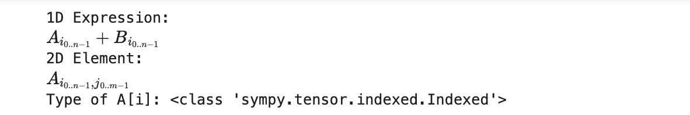

# 第二章：基礎指標系統 (The Indexed System)

在進入複雜的幾何張量前，我們先學習如何用 SymPy 表達像 $A_i$ 或 $M_{ij}$ 這樣單純的「帶指標數學物件」。這在處理級數求和、生成 C/Fortran 程式碼，或是處理量子力學中的簡單算符時非常有用。

## 2.1 IndexedBase 與 Idx

要建立一個帶指標的變數，我們不能只用標準的 `Symbol`，我們需要兩個新工具：
1.  **`IndexedBase`**：代表變數的「本體」（例如 $A$）。
2.  **`Idx`**：代表「指標」本身，通常帶有範圍（例如 $i \in [0, N-1]$）。

### 程式碼實作

```python
from sympy import symbols, IndexedBase, Idx, init_printing

# 設定漂亮顯示
init_printing()

# 1. 定義維度符號 (可以是具體數字，也可以是符號)
n, m = symbols('n m', integer=True)

# 2. 定義基底符號 (Base)
# 這代表數學上的 A 和 B，它們將被視為陣列
A = IndexedBase('A')
B = IndexedBase('B')

# 3. 定義指標 (Indices)
# 定義指標 i，範圍從 0 到 n-1
# 定義指標 j，範圍從 0 到 m-1
i = Idx('i', n) 
j = Idx('j', m)

print("Base objects:", A, B)
print("Index objects:", i, j)
```


### 關鍵概念解說
*   **`IndexedBase('A')`**：告訴 SymPy，`A` 不是一個單純的純量，而是一個可以被索引的物件（容器）。
*   **`Idx('i', n)`**：這比單純的 `Symbol('i')` 帶有更多資訊。它隱含了 $0 \leq i \leq n-1$ 的限制。如果未指定範圍（如 `Idx('i')`），則範圍未定。

---

## 2.2 基本運算

在 `IndexedBase` 系統中，操作方式非常直觀，就像在寫 Python 的 list 或 NumPy array，但內容是符號。

### 賦值與存取元素

我們可以通過 `[]` 來存取元素。注意，這裡產生的物件類型是 `Indexed`。

```python
# 建立一個表達式：A_i + B_i
expr1 = A[i] + B[i]

# 建立二維元素：A_{ij}
expr2 = A[i, j]

print("1D Expression:")
display(expr1)  # Jupyter 中會顯示 A[i] + B[i]

print("2D Element:")
display(expr2)  # Jupyter 中會顯示 A[i, j]

# 檢查物件類型
print(f"Type of A[i]: {type(A[i])}")
# 輸出: <class 'sympy.tensor.indexed.Indexed'>
```



> **注意**：在這裡，`A[i]` 和 `A[j]` 被視為完全不同的東西。這與下一章的抽象張量不同（在抽象張量中，$v^\mu$ 和 $v^\nu$ 指的是同一個幾何實體，只是指標名字不同）。在 `IndexedBase` 系統裡，它們就是陣列中不同位置的元素。


### 簡單的求和運算 (`Sum`)

這是本章最重要的部分。由於 `IndexedBase` **不支援** 自動的愛因斯坦求和約定（Einstein Summation Convention），所有的求和都必須顯式地寫出來。

我們使用 SymPy 的 `Sum` 函數來表達 $\sum$。

```python
from sympy import Sum

# 例子 1：內積 (Inner Product)
# 數學式: S = sum(A_i * B_i, i=0..n-1)
inner_product = Sum(A[i] * B[i], (i, 0, n - 1))

print("Symbolic Summation:")
display(inner_product)

# 例子 2：矩陣乘法分量 (Matrix Multiplication Component)
# C_ij = sum(A_ik * B_kj)
# 我們需要一個新的指標 k
k = Idx('k', n) # 假設 A 是 n*n, B 是 n*n

# 定義矩陣乘法的第 (i, j) 個元素
matrix_mult_element = Sum(A[i, k] * B[k, j], (k, 0, n - 1))

print("Matrix Multiplication Element C_{ij}:")
display(matrix_mult_element)
```


### 展開求和 (`doit`)

如果維度 `n` 是具體的數字，我們可以使用 `.doit()` 方法將求和展開成實際的加法式子。

```python
# 設定一個具體維度為 3 的指標
dim = 3
k_concrete = Idx('k', dim)

# 定義簡單的平方和
sum_squares = Sum(A[k_concrete]**2, (k_concrete, 0, dim - 1))

print("Concrete Summation (N=3):")
display(sum_squares)

print("Expanded Result:")
expanded = sum_squares.doit()
display(expanded)
# 預期輸出: A[0]**2 + A[1]**2 + A[2]**2
```


---

### 常見錯誤提醒

1.  **不要混用 `Symbol` 和 `Idx` 作為指標**：
    雖然 `A[Symbol('x')]` 在語法上是合法的（SymPy 會把它當作任意標籤），但在配合 `Sum` 運算時，最好使用 `Idx`，因為它明確定義了整數範圍。

2.  **這不是矩陣物件**：
    `IndexedBase` 不是 `Matrix`。SymPy 的 `Matrix` 物件支援 `.inv()`, `.det()` 等線性代數方法，但 `IndexedBase` 只是符號化的陣列。如果你需要做矩陣運算（如求反矩陣），請使用 `sympy.Matrix`；如果你需要表達通用的指標邏輯（如 $A_{i+1} - A_i$），請使用 `IndexedBase`。
